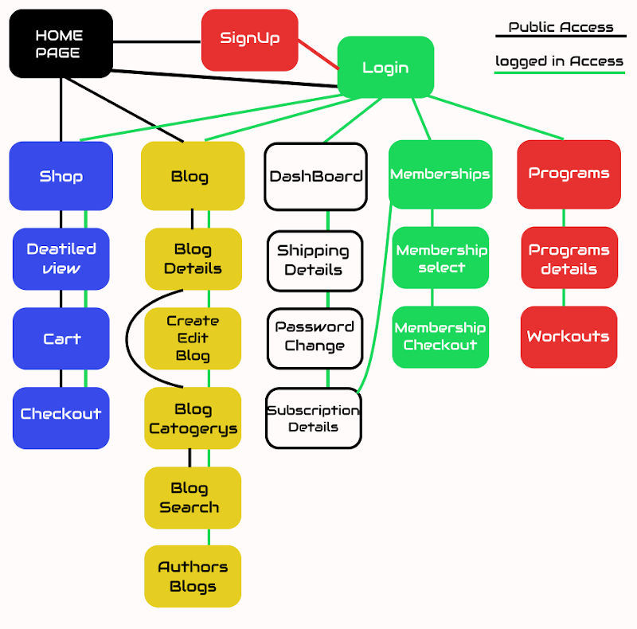
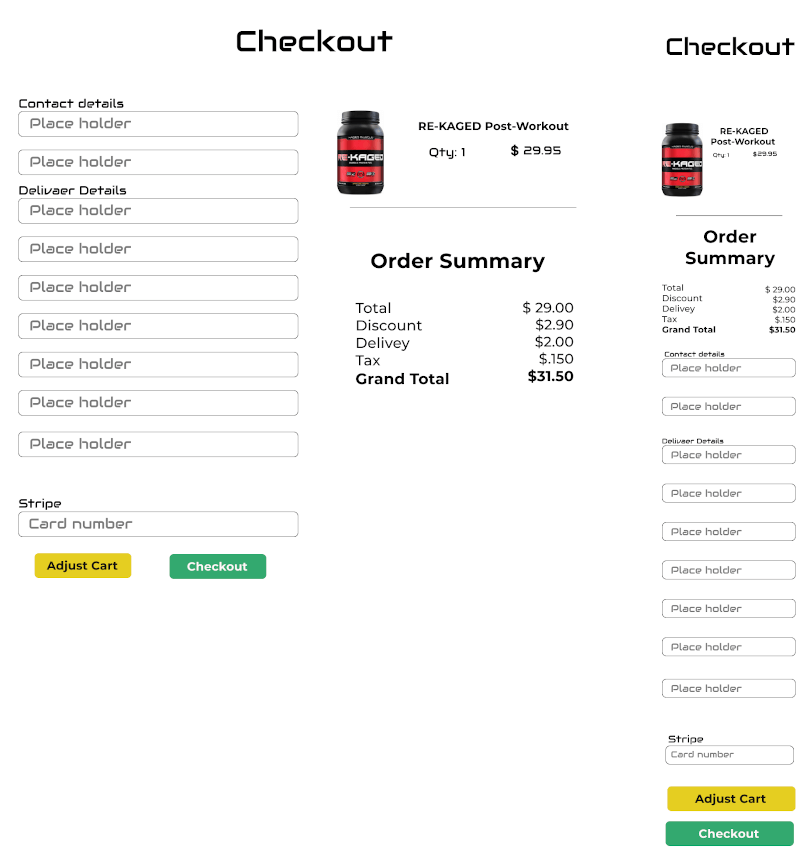
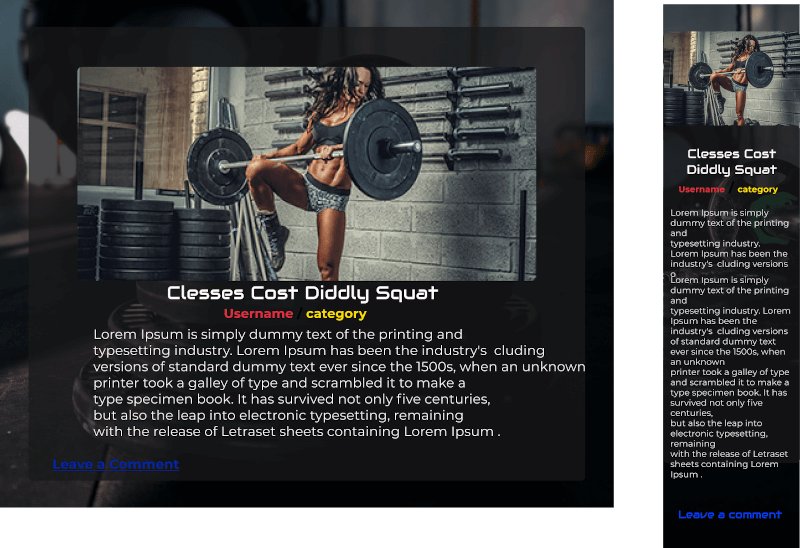
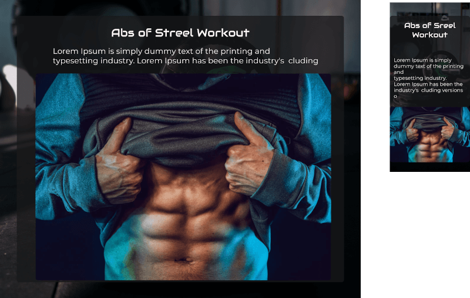

# Focus Fitness

## <i> Full Stack Frameworks With Django - Code institute </i>

---

> **Focus Fitness** -  is an online gym portal where you can get everything you need to not just survive. Thrive!

---

 [](https://shields.io/) [](https://www.python.org/downloads/release/python-360/) [](https://shields.io/) 

## Demo

[](https://focus-fitness.herokuapp.com/)

---

## Table of Contents

1. [**UX**](#ux)
2. [**Scope**](#scope)
3. [**Structure and Wireframe Mockups**](#structure)
    - [**Navigation**](#navigation)
    - [**Home Page (Index.html)**](#home)
    - [**Focus Shop**](#shop)
      - [*Detailed View*](#detailed-view)
      - [*Cart*](#cart)
      - [*Checkout*](#checkout)
      - [*Checkout Success*](#checkout-success)

    - [**Blog**](#blog)
      - [*Blog Categories Page*](#blogcategories)
      - [*Blog Details*](#blogdetails)
      - [*Blog Create and Edit**](#blogcreate)
      - [*Blog Authors Page*](#blog_authors_page)

    - [**Programs**](#programs)
      - [*Program Details*](#program-details)
    - [**Memberships**](#Membership)
      - [*Program Details*](#program_details)

    - [**Workouts**](#workouts)

    - [**Dashboard**](#dashboard)
    - [**About Page**](#about-page)
    - [**Contact Page**](#contact-page)

4. [**Surface**](#surface)
5. [**Technologies**](#technologies)
6. [**Features**](#features)
7. [**Testing**](#testing)
8. [**Bugs**](#bugs)
9. [**Deployment**](#deployment)
10. [**Credits & Acknowledgements**](#credits)

---

## UX

My directive was to make an online community based around a fitness brand: **Focus Fitness**
A blog where users can interact with each other and get tips and trips from the Pros.
Users would be able to subscribe to our training programs and also be able to do once-off purchases from our eCommerce store.

### User Stories

1. It would be nice to be able to get everything I need to start my training from one website.
2. I would like to see if there are any special offers.
3. I would like to be able to purchase an item from the shop without having to log in.
4. I would like to read Professional blog about training and nutrition.
5. I would like to be able to watch a video on how to do exercises and techniques.
6. I would like to have a place where I can see all my past orders
7. I would like to be able to comment on other members blogs.
8. I would like to be able to ask questions about a product or blog post.
9. I would like to be able to review and rate products.


---

[Back to Top](#table-of-contents)

## Scope

**Focus Fitness** is a responsive subscription-based fitness portal, that allows users to read gym-related blog use the focus shop or subscribe to the trainging programs. Anyone may read the blog and use the Shop.
We will be using [Django](<https://www.djangoproject.com/>) web framework and the site will be hosted on  [Heroku](https://www.heroku.com/postgres) using [Heroku Postgres](https://www.heroku.com/postgres) for the database.

**User**
To become a user registration is required. Once users are logged in they will be able to access there dashboard where they can find past order history (if any) change their user password, gain access to a membership subscription, change shipping details, and have a list of all the blogs they have posted.
Gain access to Members blogs where they can leave comments or write there own blogs.
Users may rate and review products.
Subscribed user members get access to all the Training and Nutritional Programs. As well as a store discount.

**Administration**
There should be an admin area where staff can control the workings of the site,
From the admin area, we would like to control the stores’ products, add, edit or delete, and make out of stock or put on sale.
A place to collect all the orders that as they are made.
Control of the blogs in required, to be able to add a new blog from admin or main blog page, delete or edit blogs if users break code of conduct.
Keep track of likes and comment s to see where the interest heading.
Control the Training Programs content to be able to add or delete or edit.
Have a place for all the newsletter emails
And be able to change users membership level.

---

[Back to Top](#table-of-contents)

## Structure

The basic structure of the web page is
*Navigation* - Top level
*Body* - Main page elements
*Footer* - More navigation, email signup and legal

This layout is thought out the web page.
For a more detailed look at web site structure and page flow see Structure Diagram.

<details>
<summary>Structure Diagram (Click for image)</summary>

<p align="center">

</p>

</details>

#### Signup (Registration) and Login

I have used a 3rd Party package called [Allauth](https://django-allauth.readthedocs.io/en/latest/) to take care of the logic. 
The users are asked to fill in the Registration with fields ‘Email’, ‘Username’, and password, this is done twice to make sure they are both the same.
You may also use the social account sign up. Facebook and Google.
**Login.**
You may use the social account buttons to sign in or use the form.
The form has two fields, ‘email’ and ‘Password’  and a remember me button and a link to your if you have forgotten your password.
All of [Allauth](https://django-allauth.readthedocs.io/en/latest/) HTML  pages have been customised to fit the themes of the site.
Full Page background with a center-block design.

<details>
<summary>SignUp and Login Wireframes (Click for image)</summary>

<p align="center">

</p>

<p align="center">

</p>
</details>

#### **Navigation**

##### Top Navigation

The navbar is sticky (fixed) to top of each page, This makes navigation easer and qicker.
It is divided into 3 part

- **Left - Focus Fitness Logo** -  Clickable link to the home page from anywhere on the web site
- **Center - Page navigation** - This is the main page navigation, this with change if the users is logged or not.
- **Right -User login and Cart** - This changes if the user is login or not.

##### The Footer

The footer stays at the button of each page.
It is broken into 3 parts.
Part 1 - Is the Logo.
Part 2 - has the newsletter submitting form, the social icons and the legal.
Part 3 - is more navigation to the pages of the site. Studies have shown that having some navigation on the footer increases hit rate on a websites.
On the desktop they sit next to each. On mobile the part 2 and 3 are next to each other and part 1 is below.

<details>
<summary>Head Navigation / Footer (Click for image)</summary>

<p align="center">

</p>

</details>

---
[Back to Top](#table-of-contents)

#### **Home Page (index.html page)**
The home page or Index page is the main page for users to interact with.
It is divided into 4 sections.

**Section 1**

Full-page background in black and white, in the middle, is a dark semitransparent block with the Focus Fitness heading and the mantra underneath.
Underneath that are the main navigation buttons that are coloured using the supplementary colours.

**Section 2**

3 clickable tiles each linking to there information they are displaying.
The first one is displaying the Trainging Program categories, the 2nd one is about the blogs the 3rd one is showing all the categories of products in the shop.
This a brief description of the Subscriptions and what perks you get for joining up.
This is also dynamic If the member is a subscribing user this section is not shown.

**Section 3**

Here you will find all the special offer that are on offer in the shop.
Each item is clickable and will go directly to the product detail page.

**Section 4**

Here are displayed all the featured blog, again clickable and will take to you to the blog post.

<details>
<summary>Home Page Wireframes (Click for image)</summary>

<p align="center">


</p>

</details>

---
[Back to Top](#table-of-contents)

## Focus Shop

*Layout*
*The shop heading is top center*. -To let the user know where they are
*Products Filtering area* - This get middle page, for easy accessibility
*Product Cards* - The lower middle and the rest of the page,

*Product Filtering area*
The category selectors are coloured in the supplementary colour to distinguish them apart at a glance
All products/ Activewaer & Eqp/ Supplements /Special offers
All products - lets you sort by price, lowest to highest or by Category in an alphabetical order.
Activewaer - let you sort by individual Activewaer categories
Supplements - let you sort by individual supplements categories
Special Offers - shows you all the Special Offers
On the Right hand side there is a selector that lets you order by:
Price -(low-high) or (high-low)
Name - (A-Z) or (Z-A)
Category (A-Z) or (Z-A)
On the right hand side is another way to get back to default ordering and shows you how many products are in the search
*Search bar*
Here you can search a word or a the product name and it will look for a match in the title or in the description of the product.

*Product cards*
The products are displayed on cards that sit side next and on top of each other.
The product picture is at the top with the name of the product underneath.
If the product is on sale it will be shown here with a ‘was’ price next to it.
The price of the item is displayed in bold numbers.
The category is below the price.
Next is the stars rating. The product is rated by the users and the average of all the ratings is displayed here, total out of 5.

<details>
<summary>(Click for image)</summary>

<p align="center">

</p>

</details>

#### Product Details

The Details page is a center block design, with breadcrumbs navigation in the top left.
The center is divided in half, the left hand side a picture of the product and on the right is the information
Name / category / rating / price
Below is a size selector, if the product has a size this is there,
Next is a quantity selector - and +
The Add to Cart button is below.
The bottom part of the block is for the Product Overview
This is where there are more details about the product.
Under that there is the reviews section
The product's overall rating is displayed here.
This is where you write your review.
Below is a list of all the reviews and individual ratings the users gave the product.

<details>
<summary>Shop Detail View WireFrames (Click for image)</summary>

<p align="center">

</p>

</details>

#### Shopping Cart

The Cart is where you see a list of all the products that you have added.
Center block design. The top horizontal half is a list of all the products with a small image on the left name / prince/ and a quantity adjuster if you have made a mistake, you can also remove  the product form here.
The Order Summary is below the products list and hold all the details of your order
Cart Total / discounts (if applicable) / Subtotal / Delivery charge / Tax amount (Note is is added into the total amount, The tax amount is just to show how much it it)
Grand Total
The Keep shopping button will take you back to the shop, and checkout will take to the check out.

<details>
<summary>Shopping Cart Wireframes(Click for image)</summary>

<p align="center">

</p>

</details>

#### Checkout

Full page layout with the user order form to complete. Contact details and delivery address.
Where is a Save information to profile button that if pressed the information will be autofilled next time they use the shore.

A Stripe payment system is inplace and takes all major cards.
The numbers below are used to test the Stripe Payment software.

- Card number - 4242 4242 4242 4242

- CVC - Any 3 digit number.

- Expire date - Any date in the future

If you need to adjust the cart there is an Adjust cart button to take you back or Complete Order.

<details>
<summary>(Click for image)</summary>

<p align="center">

</p>

</details>

#### Checkout Success

Two center blocks one on the left and right both hold all your order details.
Breadcrumbs in the top left will take you to your dashboard.
The left block has the order number / Date of order / detail of what you have ordered and the paid amounts / Stripe Receipt.
Clicking the receipt will sent to a new page with you stripe receipt

<details>
<summary>(Click for image)</summary>

<p align="center">

</p>

</details>

---
[Back to Top](#table-of-contents)

### **Blog**

The blog post is the main source of communication in Focus Fitness, it is how all the user connect with each other, by right blog about how they are getting on, experiences and success they have had, products or workouts they have used from the Focus Shop or Membership Programs. A special Category call Members is for users to support each other and getting support from our Focus Fitness Trainers.
Featured Blog is chosen by our Trainers and is generally written by Pro trainers or athletes.

The Blog Page is broken down into separate parts

- **Featured**
Is the first thing you see. And uses a carcel to flip through.

- **Category selection**
A green and grey Category selection box is on the right-hand side.
Here you will find all the available categories and some information on each.
Each category is colour coded.

  - **Members**
This is for our users to connect with each other, write blogs about how they are enjoying one of our Focus Products or how a Membership program is working for them. If they have a question or comments on how to do anything they will be answered by our Focus Trainers in this category. By leaving comments on their blog post.

  - **Covid-19**
In this category, we will take about everything COVID and gym-related, its managing training in lockdowns and gym hygiene. 

  - **Dieting**
All blog post that are diet-related, tips tricks and pitfalls 

  - **Endurance**
All blogs that focus on the endurance training side of thing, Running, Cycling, Swimming
Strength Training
This is a post the have to do with Resistance training, bodybuilding, techniques tips, tricks and pitfalls

  - **Recovery**
All blogs to do with the recovery side of the gym. Sleep, post-gym products, tips, tricks and pitfalls.

- **Blogs**
This is where all the other blogs live.
All blog borders are colour coded as per there category, to make it easer to see what category a blog is at a glance.

- **Members Blogs**
Underneath the Category selection box is the Members blogs, a list of all the user member’s blogs shows up here. 

<details>
<summary>Blog List Wireframes (Click for image)</summary>

<p align="center">

</p>

</details>

#### Blog Categories Page

Once the category selection has been made, they will be redirected to here.
All the blog post in that category will be displayed.
Only logged in users may see the Members posts

<details>
<summary>Blog Categories Wireframes (Click for image)</summary>

<p align="center">

</p>
</details>

#### **Blog Detail Page**

Once the user has selected the blog post they would like to read, They are redirected to the blog detail page. blog_detail.html.
The blog post with the only element on this page. Witch in include the

- Blogs Title
- The author
- The blog post its self
- The amount of views, likes, and comments the post have
- Also the age of the blog post.

Once the user has finished reading the post there is a section where a user may ‘like’ or leave a comment.
Note only logged in user may use this feature.

<details>
<summary>Blog Detais Wireframes (Click for image)</summary>

<p align="center">

</p>

</details>

#### **Create and Edit Blog Page**

The create and edit blogs views share the same HTML file: blog_form.html
The HTML is a form that has all the needed fields to fill out when creating or editing a blog.
The difference is when your creating a post the form is blank with ‘placeholders’ to guild you.
When your editing a post, all the fields are prefilled with the data needed to edit.
Only logging in users may create or edit a blog post and
only the Author of a blog post is authorised to edit a post.
We use [CKEditor](https://ckeditor.com/) to format the blogs post, this gives the user all the tools to use in creating good content.

<details>
<summary>Blog Create/Edit Wireframes (Click for image)</summary>

<p align="center">

</p>
</details>

#### Blog Author Page

By Clicking on the authors name in the details blog page, you will be redirected to this page.
Here you will be able to see all the blogs that this user has written.
Each title is a link to the blog and you can see the amount of likes, comments, and thump up each post has.

<details>
<summary>Blog Create/Edit Wireframes (Click for image)</summary>

<p align="center">

</p>

</details>

#### **Memberships**

Are an important part of how Focus Fitness works. There are 2 types of memberships
Free and Pro
The Free memberships are given to anyone who joins Focus by logging in. when you log in you profile is made and free status is given.
This grains you asses to:

- Writing Blog pos
- Commenting rating and review on  blogs post and Products.
- The Dashboard
- The Pro or (Profesional) membership will give you access to all of the above and access to the Programs.
It is a monthly subscription.
To become a Pro member Click the ‘Select button on the card and you will be redirected to the members-payment page.
Simple Center block design with the memberships details and monthly amount that will be billed.
Below is the Stripe Payment Field.
To Cancel a Subscription, it can be done viva the Dashboard in the subscription tab.

<details>
<summary>Chow Schema (Click for image)</summary>

<p align="center">

</p>
</details>

#### **Programs**

Only Subscribed users may use this app.
The Programs page is where the user can find the programs they have subscribed to.
The page is center based with horizontal cards stacked on top of each other.
They consist of the different categories.
Endurance Training
Static Stretching
Strength training
Dieting
More can be added in the administration section.

##### Programs Details

The page is a center block design and is divided in half.
On the Left hand side is the description of the category the member has chosen.
On the right hand side is the list of workouts within that Program.
The workouts are all video based and can be added or ordered in any way the trainer wishes to show them.

<details>
<summary>Programs WireFrame(Click for image)</summary>

<p align="center">

</p>
</details>

#### **Workouts**

Once the workout is selected, you will be redirected to the workout.
Its a center-block design which displays the title and the context of the work out.
Below this is a video play which will fit the size of the user's display.
The video files itself is Not stored in the Focus Fitnesses database they are linked with a url from a video hosting server. Focus fitness uses Cloudinary  
To add a video:
Make a Cloudinary account
Upload the video
Once it is uploaded a video url is given
In the Focus admin section click on workouts in the Programs section
Click ‘Add new’
Fill out the form adding the url.


<details>
<summary>Workouts WireFrame(Click for image)</summary>

<p align="center">

</p>
</details>

#### **Dashboard**

The Dashboard is where the login in user can access all their personal information.
It is divided into 3 parts.

###### Profile Admin

- Here you can change your user password.
- You can change or add your delivery details.
- All see that subscription level you are at,   It the user is a top-level subscription, (Pro)  you are able to see when the next payment is due.

###### My Blogs

- Here you can see all the blogs you have written, and if you haven’t written any yet, there is a link to start.

###### Orders History

- Here youll find a table will all you order history on it. Click on the blue coloured Order number to get the full Order.
- The Orders are ordered from newest to oldest.
- There is also a link to get you Stripe receipt.

<details>
<summary>Dashboard Wireframes (Click for image)</summary>

<p align="center">

</p>

</details>

#### **About**

The About page has a centre block format with a heading and information about Focus Fitness.

<details>
<summary>About Page Wireframes (Click for image)</summary>

<p align="center">

</p>
</details>

---
#### **Contact Us**

The About page has a centre block format with a heading and information about Focus Fitness.

<details>
<summary>About Page Wireframes (Click for image)</summary>

<p align="center">


</p>
</details>

#### **Data Base**
For this Project we used Sqlite3db in development and Postgressdb hosted in HerokU in production

<details>
<summary>Chow Schema (Click for image)</summary>

<p align="center">

</p>
</details>

---

[Back to Top](#table-of-contents)

## Surface

#### Fonts

- [Montserrat](https://fonts.google.com/specimen/Montserrat?query=montserrat) - Primary Font
- [Audiowide](https://fonts.google.com/specimen/Audiowide) - Secondary Font

The primary font [Montserrat]("https://fonts.google.com/specimen/Montserrat")</> is used the body of all pages. I chose it because of its readability and accessibility. It complements the secondary font.
The Secondary is [Audiowide](https://fonts.google.com/specimen/Audiowide") is used in the logo and transposes well to the  Heading and buttons, the technology styled, typeface gives it a young and edgie feel and yet cleanly readable.

#### Colour Scheme

-  `rgb(247, 247, 247)` - Primary-(Headings and text)
-  `rbg(0, 0, 0, 0.8)` - Secondary (Header, Footer Backgrounds)
-  `rgb(27, 216, 125)` - Supplementary colour 1
-  `rgb(231, 49, 63)` - Supplementary colour 2
-  `rgb(229, 206, 33)` - Supplementary colour 3
-  `rgb(91, 192, 222)` - Supplementary colour 4

The colour scheme is all about contrast, there are a lot a dark background with white text and bold bright colours used sparingly throughout the site.
The Supplementary colours        follow the Olympic weightlifting colours standard. The colours are bold and work with the theme.

---

#### Images

Images are used extensively. The pictures we chose are all gym and fitness related. We used them a background in most of the site. We darkened the original pictures to fix in with the colour schema.

All images where source using [Unsplash](https://unsplash.com/) and have a CC licence. 
A list of all the pictures can be fond (make link)here

---

The Header and Footer image of a wooden floor has been adjusted to give it a deep red colour. The colour complements the background image.

<details>
<summary>Header and Footer Image</summary>

<p align="center">


</p>
</details>

---

[Back to Top](#table-of-contents)

## Technologies

##### Core Languages, Frameworks, Editors

- [HTML 5](https://en.wikipedia.org/wiki/HTML) ~ Markup language designed to be displayed in a web browser.
- [CSS 3](https://en.wikipedia.org/wiki/Cascading_Style_Sheets) ~ Style sheet language used for describing the presentation of a document in HTML.
- [Python 3.8](https://code.jquery.com/) ~ High-level, general-purpose programming language.
- [Django 3.0.8](https://www.djangoproject.com/) ~ Django is a high-level Python Web framework.

- [jQuery 3.5](https://code.jquery.com/) ~ lightweight JavaScript library.

- [Bootstrap 4.5](https://getbootstrap.com/) ~ Design and customize responsive mobile-first sites.

- [Heroku](https://heroku.com) ~ A cloud based platform as a service enabling deployment of CRUD applications

- [Heroku Postgres](https://www.heroku.com/postgres) ~ PostgreSQL's capabilities as a fast, functional, and powerful data resource.

- [Visual Studio Code](https://code.visualstudio.com/) ~ Code editor redefined and optimized for building and debugging modern web and cloud applications.

##### Third-Party Tools

- [Font Awesome](https://fontawesome.com/) ~ Font Awesome icons
- [icons8](https://icons8.com/icons/set/instagram-logo) ~ Icons8 icons
- [cloudinary](https://cloudinary.com/) ~  Cloud-based image and video management platform
- [GitHub](https://github.com/) ~ Distributed version control and source code management (SCM) functionality of Git, plus its own features.
- [Git](https://git-scm.com/) ~ Distributed version control system
- [Figma](https://www.figma.com/) ~ A digital design and prototyping tool. It is a UI and UX design application that you can use to create websites, apps.
- [Slack](https://slack.com/intl/en-ie/) ~ A workspaces allowing you to organize communications by channels for group discussions and allows for private messages to share information.
- [Website Responsive Testing](https://responsivetesttool.com) ~ A means of testing the website or URL from different devices.
- [Pep8online](http://pep8online.com/) ~ PEP 8 is a online Python style guide. It's a set of rules for how to format your Python code.
- [W3 Validator](https://validator.w3.org/nu/) ~ The Markup Validation Service.
- [W3C CSS Validation](https://jigsaw.w3.org/css-validator/) ~ A CSS validator checks your Cascading Style Sheets to make sure that they comply with the CSS standards set by the W3 Consortium.
- [TinyPNG](https://tinypng.com/) ~ A smart lossy compression technique to reduce the file size of your PNG files.
- [Google Fonts](https://fonts.google.com/) ~ A library free licensed font families, an interactive web directory for browsing the library.
- [CSSMatric](https://cssmatic.com/) ~ Automatically generates the code and shows you the effects in real time.

---

[Back to Top](#table-of-contents)

## Features

### Existing Features

##### Navbar

- Changes dymamicaly
This changes depending on the membership status of the user.
If the user is not logged in it shows the basic menu with signup/Login and shopping cart

If the user is login but not a Pro member the menu extends to include there
Dashboard, Programs, Logout.
- Username and Admin Login

  The Top right is now the users Username and a user icon.
  If the user is a ‘Staff’ member a link to the admin ear is shown.
  

#### Footer

- Changes dymamicaly.
The footer is dynamic and changes if the user is logging in or not. If not the menu button say login, *Blog*, *Shop*, *Sign up*,
If the user is logged in the menu changes to: 
*Subscribes*, *Blog*, *Shop*, *Logout*.
And if the user is a Pro member, *Subscribes* changes to *Programs*.
- Newsletter:
The Newsletter sign ups form is in the footer. This way it is always on every page.
- Back to Top.
The Back to the top button is global but you see it mostly in the footer, This is a handly way to get back to the top of the page.

#### Home Page (Index Page)

*Section-1*

- Dynamic buttons
  The 4 main buttons in section 1 of the main page are dynamic and change with the user membership level.
  A public user will see Shop Sign up and Login Blog

  

  If the user has logged in but not a Pro member the button will change to

  

  If the user is a Pro member the buttons will change to

  

*Section-2*

The tiled center block.
The 3 tiles are links to different parts of the site. They are clickable and lead to Training Programs, Blogs and the Focus Shop.

*Section 3*

- Dynamic Subscription section.
The subscription section users membership status.
If the user is a Pro member this section is hidden. This gives the user less scrolling to get to the shop.

*Section 4*

- The Special Offers section
Holds all the special offers that are listed.
- Clickable Products
The products are clickable and will take you to that products detailed page, where you can add to cart.
 controlled in the admin All the products that are displayed here are controlled in the admin ears.
- Hidden Dynamically
If there are no special offers the section will be hidden.

*Section 5*

- Featured Blogs
All the featured blogs are shown here with the help of Bootstrap's Carousel
- Clickable blogs
The blogs are clickable and will take you to the blog details where you can read it.
Controlled in the admin All featured blogs are controlled in the admin area.

##### Blog Page

- Featured Blogs The same feature that is used in Home page Section 5 is used in the blog list page.
- Search Blogs
The search bar in the blogs section will look for a matching word or words in either the name or content of the blogs. If there are any matches they will be displayed in the blog search page. If there are none there is a link back to the blog page.

- Colour Code Categories.
The Categories in the blog menu are colour coded to make it easier to distinguish the blogs. Each blog post has a coloured border that matches the category colour.
- Likes, Views and Comments
Every time a logged on user clicks and views a blog it is recorded and shown on the blogs views counter. If a blog is liked it shows up in the thumbs up count. And the same if a blog is commented on.
- Members Blog Block
The members block is where all the members blog will be posted.
- Members block restricted access
Only logged in users may view the member blogs
- Find all blog from author
When you are on the blog's detailed page clicking on the authors name will bring you to their blogs page. Here you will be able to see all the blogs they have written.
All the blogs in their page are ordered from newest to oldest.
- Commenting on Blogs
This way the users can connect with each other, ask questions, leave answers, or just comment.
*Creating and Editing blogs*
- User access
Only login users may create or comment on blogs
- Blog Author Control
Only the blogs authors may edit there blogs
- Ckeditor
Ckeditor is used to create or edit blogs, this gives the user a lovely interface to write, link, and add pictures to a blog post.
-Controlled from Admin
Blogs can be written and edited front he admin area, If blogs are not inline with the rules if can be deleted without authors permission.

### Focus Shop


### Future Features

---

[Back to Top](#table-of-contents)

## Testing

- I ran the application through [Website Responsive Testing](https://responsivetesttool.com) to make sure it is responsive. Below is a list of devices:

 <details>
<summary>Mobiles</summary>
<ul>
<li>Apple iPhone 3/4/4s/5/5s/6/6s/6plus/7/7Plus/8/8Plus/X/XR/XS/XSMax</li>
<li>Nexus 6P/5X</li>
<li>Google Pixel 2/XL</li>
<li>Samsung Galaxy S S2/S3/S4/S5/S6/S7/S8/S8+/S9/S9+</li>
<li>Samsung Galaxy Nexus/Note 2/3/4/8</li>
<li>LG G3/G4/G5</li>
<li>LG Optimus G</li>
<li>LG Nexus 4/5</li>
<li>Pantech Vega n6</li>
<li>Lenovo K900</li></li>
<li>Motorola Nexus 6</li>
<li>One Plus 3</li>
<li>Nexus 7(2013)/9</li>
<li>ZTE Grand S</li>
<li>HTC One/8X/Evo 3D</li>
<li>Sony Xperia P/S/Z/Z3</li>
<li>Xiaomi Redmi Note 5</li>
<li>Xiaomi Mi 3/4</li>
<li>Blackberry Z10/Z30/Q10/CLASSIC/PASSPORT/LEAP</li>
<li>Blackberry Torch 9800</li>
<li>Microsoft Lumia 620/830/900/920/925/1020/1520</li>
</details>
 <details>
<summary>Tablet</summary>
<ul>
<li>Apple iPad Pro/Pro9.7/1/2/mini</li>
<li>Samsung Galaxy Tab 3 10"/Tab 2 10"/Tab (8.9")/Tab 2 (7")</li>
<li>Samsung Nexus 10</li>
<li>HTC Nexus 9</li>
<li>Asus Nexus 7 (v1)/(v2)</li>
<li>LG G Pad 8.3</li>
<li>Amazon Kindle Fire/HD7/HD8.9</li>
<li>Microsoft Surface Pro 2/3</li>
<li>Blackberry Playbook</li>
</details>
  <details>
<summary>Desktops</summary>
<ul>

<li>Desktop/Laptop</li>
<li>1024 x 768</li>
<li>1280 x 800</li>
<li>1366 x 768</li>
<li>1440 x 900</li>
<li>1680 x 1050</li>
<li>1920 x 1080</li>
<li>1920 x 1200</li>
<li>2560 x 1440</li>
<li>3840 x 2160</li>
<li>4096 x 2304</li>
<li>5120 x 2880</li>
</details>

---

[Back to Top](#table-of-contents)

## Bugs

**Being able to login with a different username.**
On registration the username/email and password get logged to the database. When the user logged in again, only the email was checked for duplicates. The problem was the user could login with the right email and password but wrong username.
Upon adding a new recipe, the recipes get tagged with the username from `Sessions`, which means if the user logged in with a different username but correct email and password, they get logged in but not able edit/delete their recipe.
My first fix was to add the username input on the login page and have the username from the form checked with the username from the database. But this adds another input and is not good UX.
 
> To fix this issue, The user only inputs the username once at registration. At login, once the email and passwords get checked, The `Sessions` is created using the stored username. taking away the need for a username input when logging in.
 
```python
login_user = users.find_one({'email': request.form['userEmail']})
session['username'] = login_user['name']
session['logged_in'] = True
 
```

---

[Back to Top](#table-of-contents)

## Deployment

I hosted this site using [Heroku](https://www.heroku.com/).

Heroku is a container-based cloud Platform as a Service (PaaS). I used it because it's free, elegant, flexible, and easy to use, offering developers the simplest path to getting my app up.

### To deploy on Heroku

The Heroku CLI requires Git, the popular version control system. If you don’t already have Git installed, complete the following before proceeding

- [Git installation](https://git-scm.com/book/en/v2/Getting-Started-Installing-Git)
- [First-time Git setup](https://git-scm.com/book/en/v2/Getting-Started-First-Time-Git-Setup)

<details>
<summary>Heroku Deployment Steps</summary>
<br>
<ol>
<li> Open Heroku.</li>
<li> Install the Heroku Command Line Interface (CLI). You use the CLI to manage and scale your applications, provision add-ons, view your application logs, and run your application locally.</li>
<li> Create an account and navigate to dash dashboard.
   Click on the _New_ button.
   Click - _Create New App_.</li>
<li> Create a corresponding app name that we use to deploy our application. The apps _name_ must be _unique._.</li>
<li> Pick a server location what is closest to you.</li>
<li> In your Terminal. Navigate to you directory using.</li>
<li> Login to Heroku using the Terminal `$ heroku login`</li>
<li> Create a requirements.txt file: `$ pip3 freeze --local > requirements.txt.`</li>
<li> Create Procfile: `$ echo web: python app.py > Procfile`</li>
<li> Add files to Git: `$ git add .` then `git commit -m 'Added reuirements.txt and Procfile'`</li>
<li> Push to Heroku: `$ git push heroku master`</li>
<li> Go back to Heroku dashboard and click on the apps name, then on the 'settings' Tab.</li>
<li> Specify our IP and our port using the 'Reveal Config Vars'</li>
</ol>
</details>

<details>
<summary>Clone to a workstation</summary>
<br>
<ol>
<li>On GitHub, navigate to the main page of the repository.</li>
<li>Under the repository name, click Clone or download.</li>
<li>To clone the repository using HTTPS, under "Clone with HTTPS", click.</li>
<li>To clone the repository using an SSH key, including a certificate issued by your organisation's SSH certificate authority, click Use SSH, then click.</li>
<li>Open Git Bash.</li>
<li>Change the current working directory to the location where you want the cloned directory to be.</li>
<li>Change the current working directory to the location where you want the cloned directory to be.</li>
<li>Type ‘’’git clone’’’ and then paste the URL you copied in Step 2.</li><li>Press Enter. Your local Clone will be created.</li>
</ol>
</details>

---

[Back to Top](#table-of-contents)

## Credits

##### Code Tutorials

- [Julian Nash](https://www.youtube.com/channel/UC5_oFcBFlawLcFCBmU7oNZA) ~ YouTube
- [Pretty Printed](https://www.youtube.com/channel/UC-QDfvrRIDB6F0bIO4I4HkQ) ~ YouTube
- John Elder ~ [Codemy](https://codemy.com/about/)
- Febin George ~ [Udemy](https://www.udemy.com/)
- Anthony Ngene ~ Code Institute ~ Mentor
- Leonardo Monteiro Fernandes ~ [Ripple Effect](https://medium.com/@leonardo.monteiro.fernandes/css-techniques-for-material-ripple-effect-3f0ece3062a0)

##### Media

[Unsplash](https://unsplash.com/) ~ The internet’s source of freely-usable images.

- [Luca Ruegg](https://unsplash.com/s/photos/luca-ruegg)
- [Andy Chilton](https://unsplash.com/s/photos/andy-chilton)
- [BBC Food](https://www.bbc.co.uk/food) ~ for the recipes

---

#### Acknowledgements and Special Thanks

To everyone in Slack, especially how it helped me figure the Virtual Environment. My Mentor Anthony Ngene, for pushing me.
Thank you.

###### <i>Disclaimer: This project was created for educational use only as part of the Code Institute Full Stack Software Development Course for Milestone 3!</i>

[Back to Top](#table-of-contents)