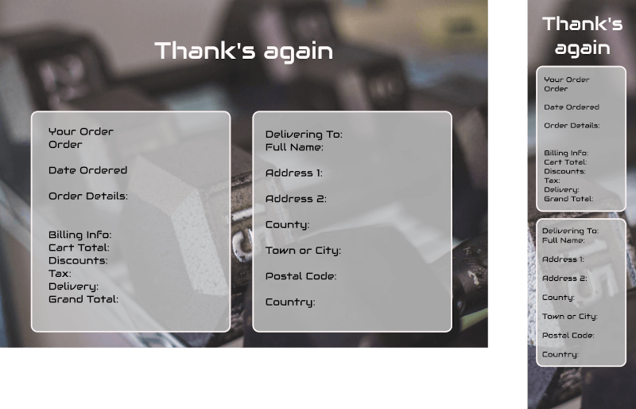
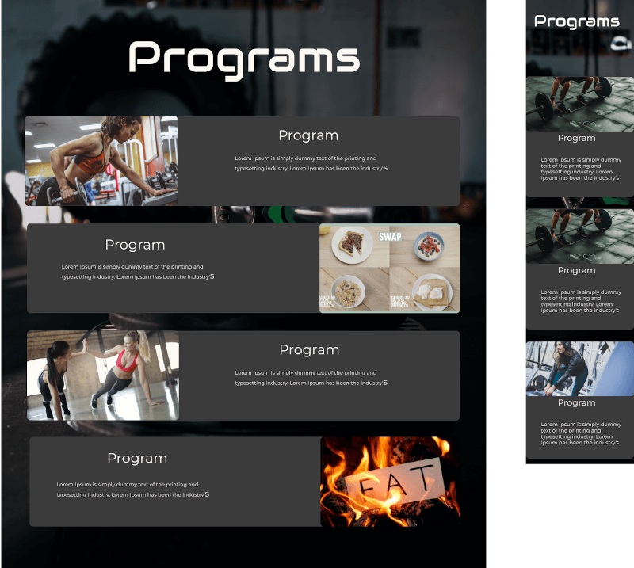
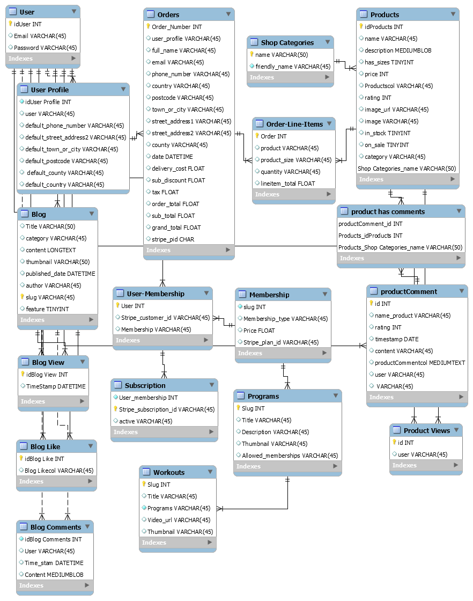

# Focus Fitness

## <i> Full Stack Frameworks With Django - Code institute </i>

---

> **Focus Fitness** -  is an online gym portal where you can get everything you need to not just survive. Thrive!

---
[](https://travis-ci.org/Clinton-Davis/focus_fitness) [](https://www.codacy.com/manual/Clinton-Davis/focus_fitness/dashboard?utm_source=github.com&amp;utm_medium=referral&amp;utm_content=Clinton-Davis/focus_fitness&amp;utm_campaign=Badge_Grade) [](https://shields.io/) [](https://www.python.org/downloads/release/python-360/) [](https://shields.io/)

## Demo

[](https://focus-fitness.herokuapp.com/)

---

>## Table of Contents
>
>1. [**UX**](#ux)
>2. [**Scope**](#scope)
>3. [**Structure and Wireframe Mockups**](#structure)
>    - [**Navigation**](#navigation)
>    - [**Focus Shop**](#focus-shop)
>    - [**Blog**](#blog)
>    - [**Memberships**](#Membership)
>    - [**Workouts**](#workouts)
>    - [**Dashboard**](#dashboard)
>    - [**Home Page**](#home-page)
>    - [**About Page**](#about-page)
>    - [**Contact Page**](#contact-page)
>    - [**Programs**](#programs)
>4. [**Surface**](#surface)
>5. [**Technologies**](#technologies)
>6. [**Features**](#features)
>7. [**Testing**](#testing)
>8. [**Deployment**](#deployment)
>9. [**Credits & Acknowledgements**](#credits)

---

## UX

My directive was to make an online community based around a fitness brand: **Focus Fitness**
A blog where users can interact with each other and get tips and trips from the Pros.
Users would be able to subscribe to our training programs and also be able to do once-off purchases from our eCommerce store.

### User Stories

#### User

- As a user, I want to access the website from any device.
- As a user, I want to easily navigate between the pages
- As a user, I want to link to the social pages of the company.
- As a user, I want to be able to see there special offers
- As a user, I would like to see featured blogs and other Programs that are on offer
- As a user, I want to be able to read the details of a product and be able to review and rate them.
- As a user, I would like to be able to search for a Product
- As a user, I would like to be able to purchase an item from the shop without having to log in and expect to receive a confirmation email.
- As a user, I would like to be able to search for a blog post I'm interested in
- As a user, I would like only other logged-in users to see my members' blog posts and I would like to be able to comment on other members' blogs posts.
- As a user, I would like to be able to become a member by subscribing.
- As a user, I would like to see the Professional programs they have to offer
- As a user, I would like to have a place where I can see all my past orders
- As a user, I would like to be able to change my password and shipping address
- As a user, I would like to be able to login with a social account.

#### Admin

- As administrator, I expect to be able to log in from any page.
- As administrator, I expect to be able to add, edit, delete products, blogs, programs and  memberships as needed.
- As administrator, I expect to be able to put products out of stock and on special.
- As administrator, I would like that if a staff member did not put the right ‘was’ price of the product that only the ‘price’ would be shown.
- As administrator, I would like to be able to see what products have had the most views and heights
- As administrator, I would like to be able to see all the orders that have taken place.
- As administrator, I expect to see a ‘No Image’ image if there is no image for a product.

---

<div align="right">

[Back to Top  ↑ ](#table-of-contents)
</div>

## Scope

**Focus Fitness** is a responsive subscription-based fitness portal, that allows users to read gym-related blog use the focus shop or subscribe to the trainging programs. Anyone may read the blog and use the Shop.
We will be using [Django](<https://www.djangoproject.com/>) web framework and the site will be hosted on  [Heroku](https://www.heroku.com/postgres) using [Heroku Postgres](https://www.heroku.com/postgres) for the database.

**User**
To become a user registration is required. Once users are logged in they will be able to access there dashboard where they can find past order history (if any) change their user password, gain access to a membership subscription, change shipping details, and have a list of all the blogs they have posted.
Gain access to Members blogs where they can leave comments or write there own blogs.
Users may rate and review products.
Subscribed user members get access to all the Training and Nutritional Programs. As well - as a store discount.

**Administration**
There should be an admin area where staff can control the workings of the site,
From the admin area, we would like to control the stores’ products, add, edit or delete, and make out of stock or put on sale.
A place to collect all the orders that as they are made.
Control of the blogs in required, to be able to add a new blog from admin or main blog page, delete or edit blogs if users break code of conduct.
Keep track of likes and comment s to see where the interest heading.
Control the Training Programs content to be able to add or delete or edit.
Have a place for all the newsletter emails
And be able to change users membership level.

---

<div align="right">

[Back to Top  ↑ ](#table-of-contents)
</div>

## Structure

The basic structure of the web page is
*Navigation* - Top level
*Body* - Main page elements
*Footer* - More navigation, email signup and legal

This layout is thought out the web page.
For a more detailed look at web site structure and page flow see Structure Diagram.

<details>
<summary>Structure Diagram (Click for image)</summary>

<p align="center">

</p>

</details>

#### Signup (Registration) and Login

I have used a 3rd Party package called [Allauth](https://django-allauth.readthedocs.io/en/latest/) to take care of the logic. 
The users are asked to fill in the Registration with fields ‘Email’, ‘Username’, and password, this is done twice to make sure they are both the same.
You may also use the social account sign up. Facebook and Google.

**Sign Up and Login.**
You may use the social account buttons to sign in or use the form.
The form has two fields, ‘email’ and ‘Password’  and a remember me button and a link to your if you have forgotten your password.
All of [Allauth](https://django-allauth.readthedocs.io/en/latest/) HTML  pages have been customised to fit the themes of the site.
Full Page background with a center-block design.

<details>
<summary>SignUp and Login Wireframes (Click for image)</summary>

<p align="center">

</p>

<p align="center">

</p>
</details>

### **Navigation**

#### Navbar

The navbar is sticky (fixed) to top of each page, This makes navigation easer and qicker.
It is divided into 3 part
- **Left - Focus Fitness Logo** -  Clickable link to the home page from anywhere on the web site
- **Center - Page navigation** - This is the main page navigation, this with change if the users is logged or not.
- **Right -User login and Cart** - This changes if the user is login or not.

##### The Footer

The footer stays at the button of each page.
It is broken into 3 parts.

- *Part 1* - Is the Logo.
- *Part 2* - has the newsletter submitting form, the social icons and the legal.
- *Part 3* -  is more navigation to the pages of the site. This helps with navigation, if the user is having trouble finding their way around the site, It acts like a safety net.
On the desktop they sit next to each. On mobile the part 2 and 3 are next to each other and part 1 is below.

<details>
<summary>Head Navigation / Footer (Click for image)</summary>

<p align="center">

</p>

</details>

---
<div align="right">

[Back to Top  ↑ ](#table-of-contents)
</div>

### **Home Page**

The home page or Index page is the main page for users to interact with.
It is divided into 4 sections.

#### Section 1

Full-page background in black and white, in the middle, is a dark semitransparent block with the Focus Fitness heading and the mantra underneath.
Underneath that are the main navigation buttons that are coloured using the supplementary colours.

#### Section 2

3 clickable tiles each linking to there information they are displaying.
The first one is displaying the Trainging Program categories, the 2nd one is about the blogs the 3rd one is showing all the categories of products in the shop.
This a brief description of the Subscriptions and what perks you get for joining up.
This is also dynamic If the member is a subscribing user this section is not shown.

#### Section 3

Here you will find all the special offer that are on offer in the shop.
Each item is clickable and will go directly to the product detail page.

#### Section 4

Here are displayed all the featured blog, again clickable and will take to you to the blog post.

<details>
<summary>Home Page Wireframes (Click for image)</summary>

<p align="center">


</p>
</details>

<div align="right">

[Back to Top  ↑ ](#table-of-contents)
</div>

---

## **Focus Shop**

- **Layout**
*The shop heading is top center*. -To let the user know where they are

- **Product Filtering area**
The category selectors are coloured in the supplementary colour to distinguish them apart at a glance
On the right hand side is another way to get back to default ordering and shows you how many products are in the search

- **Product cards**
The products are displayed on cards that sit side next and on top of each other.
  - Picture - is at the top
  - Name of the product.
  - Price of the item is displayed in bold numbers.
  - Category Stars rating - The product is rated by the users and the average of all the ratings is displayed here, total out of 5.

<details>
<summary>Focus Shop Wireframes (Click for image)</summary>

<p align="center">


</p>
</details>

#### Product Details

The Details page is a center block design, with breadcrumbs navigation in the top left.
The center is divided in half, the left hand side a picture of the product and on the right is the information:

- Name of the product
- Category and Rating
- Price
- Size selector, (if applicable)
- Quantity selector
- Add to Cart button.
- Product Overview -
This is where there are more details about the product.
Under that there is the reviews section
The product's overall rating is displayed here.
This is where you write your review.
Below is a list of all the reviews and individual ratings the users gave the product.

<details>
<summary>Product Details WireFrames (Click for image)</summary>

<p align="center">


</p>
</details>

#### Shopping Cart

The Cart is where you see a list of all the products that you have added.
Center block design. The top horizontal half is a list of all the products and information:

- Image on the left
- Name
- Prince
- Quantity and quantity adjuster - Here you see the quantity of a product, if you have want to adjust or remove the product.

The Order Summary is below the products list and hold all the financial details of the order:

- Cart Total
- Discounts - (if applicable)
- Subtotal
- Delivery charge
- Tax amount - (Note is is added into the total amount)
- Grand Total
- Keep shopping button - will take you back to the shop.
- Checkout button - will take to the check out.

<details>
<summary>Shopping Cart Wireframes(Click for image)</summary>

<p align="center">

</p>

</details>

#### Checkout

Full page layout with the user order form to complete:

- Contact details and delivery address.
- Save information to profile button that if pressed the information will be autofilled in next time they use the shore.
- Adjust cart button - If you need to adjust the cart.
- Complete Order - Sends the card informtion to [Stripe](https://stripe.com/)

>#### Stripe Development Card.
>
> A [Stripe](https://stripe.com/) payment system is inplace and >takes all major cards.
>The numbers below are used to test the Stripe Payment software.
>
>- Card number - 4242 4242 4242 4242
>- CVC - Any 3 digit number.
>- Expire date - Any date in the future
>

<details>
<summary>Checkout Page Wireframes (Click for image)</summary>

<p align="center">


</p>
</details>

#### Checkout Success

Two center blocks one on the left and right both hold all your order details.
Breadcrumbs in the top left will take you to your dashboard.

Left block contains:

- Order Details
- Stripe Receipt - Clicking the receipt will sent to a new page with you Stripe receipt

Right Block contains

- Contact Details
- Shipping information

<details>
<summary>Checkout Success Wireframes(Click for image)</summary>

<p align="center">


</p>
</details>

---

<div align="right">

[Back to Top  ↑ ](#table-of-contents)
</div>

## **Blog**

The blog post is the main source of communication in Focus Fitness, it is how all the user connect with each other, by right blog about how they are getting on, experiences and success they have had, products or workouts they have used from the Focus Shop or Membership Programs. A special Category call Members is for users to support each other and getting support from our Focus Fitness Trainers.
Featured Blog is chosen by our Trainers and is generally written by Pro trainers or athletes.

The Blog Page is broken down into separate parts

- **Featured Blogs**
Is the first thing you see. And uses a carcel to flip through.

- **Category selection**
A green and grey Category selection box is on the right-hand side.
Here you will find all the available categories and some information on each.
Each category is colour coded.

  - **Members**
This is for our users to connect with each other, write blogs about how they are enjoying one of our Focus Products or how a Membership program is working for them. If they have a question or comments on how to do anything they will be answered by our Focus Trainers in this category. By leaving comments on their blog post.

  - **Covid-19**
In this category, we will take about everything COVID and gym-related, its managing training in lockdowns and gym hygiene.

  - **Dieting**
All blog post that are diet-related, tips tricks and pitfalls

  - **Endurance**
All blogs that focus on the endurance training side of thing, Running, Cycling, Swimming
Strength Training
This is a post the have to do with Resistance training, bodybuilding, techniques tips, tricks and pitfalls

  - **Strength Training**
All blogs that have to do with resistance training, bodybuilding, techniques, tips, tricks and pitfalls
  - **Recovery**
All blogs to do with the recovery side of the gym. Sleep, post-gym products, tips, tricks and pitfalls.

- **Blogs**
This is where all the other blogs live.
All blog borders are colour coded as per there category, to make it easer to see what category a blog is at a glance.
They are ordered, newest to oldest.

- **Members Blogs**
Underneath the Category selection box is the Members blogs, a list of all the user member’s blogs shows up here.

<details>
<summary>Blog List Wireframes (Click for image)</summary>

<p align="center">


</p>

</details>

#### Blog Categories Page

Once the category selection has been made, they will be redirected to here.
All the blog post in that category will be displayed.
Only logged in users may see the Members posts

<details>
<summary>Blog Categories Wireframes (Click for image)</summary>

<p align="center">

</p>
</details>

#### **Blog Detail Page**

Once the user has selected the blog post they would like to read, They are redirected to the blog detail page. blog_detail.html.
The blog post with the only element on this page.
Witch in include:

- Blogs Title
- Blog author
- Blog Content
- The amount of views, likes, and comments the post have
- When the blog was created.

Once the user has finished reading the post there is a section where a user may ‘like’ or leave a comment.
Note only logged in user may use this feature.

<details>
<summary>Blog Detais Wireframes (Click for image)</summary>

<p align="center">

</p>

</details>

#### **Create and Edit Blog Page**

The create and edit blogs views share the same HTML file: blog_form.html
The HTML is a form that has all the needed fields to fill out when creating or editing a blog.
The difference is when your creating a post the form is blank with ‘placeholders’ to guild you.
When your editing a post, all the fields are prefilled with the data needed to edit.

<details>
<summary>Blog Create/Edit Wireframes (Click for image)</summary>

<p align="center">

</p>
</details>

#### Blog Author Page

By Clicking on the authors name in the details blog page, you will be redirected to this page.
Here you will be able to see all the blogs that this user has written.
Each title is a link to the blog and you can see the amount of likes, comments, and thump up each post has.

<details>
<summary>Blog Create/Edit Wireframes (Click for image)</summary>

<p align="center">

</p>

</details>

#### **Memberships**

Are an important part of how Focus Fitness works. There are 2 types of memberships
*Free* and *Professional*
The *Free* memberships are given to anyone who joins Focus by logging in. When you log in you profile is made and free status is given.
*Professional* membership is a monthly subscription.
To become a *Professional* member Click the ‘Select button on the card and you will be redirected to the members-payment page.
Simple Center block design with the memberships details and monthly amount that will be billed.
Below is the Stripe Payment Field.
To Cancel a Subscription, it can be done viva the Dashboard in the subscription tab.

<details>
<summary>Chow Schema (Click for image)</summary>

<p align="center">

</p>
</details>

#### **Programs**

Only Subscribed users may use this app.
The Programs page is where the user can find the programs they have subscribed to.
The page is center based with horizontal cards stacked on top of each other.
They consist of the different categories.

- Endurance Training
- Static Stretching
- Strength training
- Dieting

More can be added in the administration section.

##### Programs Details

The page is a center block design and is divided in half.
On the Left hand side is the description of the category the member has chosen.
On the right hand side is the list of workouts within that Program.
The workouts are all video based and can be added or ordered in any way the trainer wishes to show them.

<details>
<summary>Programs WireFrame(Click for image)</summary>

<p align="center">

</p>
</details>

#### **Workouts**

Once the workout is selected, you will be redirected to the workout.
Its a center-block design which displays the title and the context of the work out.
Below this is a video play which will fit the size of the user's display.

<details>
<summary>Workouts WireFrame(Click for image)</summary>

<p align="center">

</p>
</details>

#### **Dashboard**

The Dashboard is where the login in user can access all their personal information.
It is divided into 3 parts.
*Profile Admin*
*My Blogs*
*Orders History*

<details>
<summary>Dashboard Wireframes (Click for image)</summary>

<p align="center">

</p>

</details>

#### **About**

The About page has a centre block format with a heading and information about Focus Fitness.

<details>
<summary>About Page Wireframes (Click for image)</summary>

<p align="center">

</p>
</details>

#### **Contact Us**

The About page has a centre block format with a heading and information about Focus Fitness.

<details>
<summary>About Page Wireframes (Click for image)</summary>

<p align="center">


</p>
</details>

#### **Data Base**

For this Project we used [SQLite](https://www.sqlite.org/index.html) in development  because it is integrated as default in [Django](https://www.djangoproject.com/) and [Heroku Postgres](https://www.heroku.com/postgres) in production
[AWS S3](https://aws.amazon.com/s3/) buckets are used to hold all the Static Files.

<details>
<summary>Focus Fitness Schema (Click for image)</summary>

<p align="center">


</p>
</details>

---

<div align="right">

[Back to Top  ↑ ](#table-of-contents)
</div>

## Surface

#### Fonts

- [Montserrat](https://fonts.google.com/specimen/Montserrat?query=montserrat) - Primary Font
- [Audiowide](https://fonts.google.com/specimen/Audiowide) - Secondary Font

The primary font [Montserrat]("https://fonts.google.com/specimen/Montserrat")</> is used the body of all pages. I chose it because of its readability and accessibility. It complements the secondary font.
The Secondary is [Audiowide](https://fonts.google.com/specimen/Audiowide") is used in the logo and transposes well to the  Heading and buttons, the technology styled, typeface gives it a young and edgie feel and yet cleanly readable.

#### Colour Scheme

-  `rgb(247, 247, 247)` - Primary-(Headings and text)
-  `rbg(0, 0, 0, 0.8)` - Secondary (Header, Footer Backgrounds)
-  `rgb(27, 216, 125)` - Supplementary colour 1
-  `rgb(231, 49, 63)` - Supplementary colour 2
-  `rgb(229, 206, 33)` - Supplementary colour 3
-  `rgb(91, 192, 222)` - Supplementary colour 4

The colour scheme is all about contrast, there are a lot a dark background with white text and bold bright colours used sparingly throughout the site.
The Supplementary colours        follow the Olympic weightlifting colours standard. The colours are bold and work with the theme.

#### Images

Images are used extensively. The images chosen are all gym and fitness related. They are used as a background in most of the site. Original pictures were darkened to fit with the theme of the project.
All images were found on  [Unsplash](https://unsplash.com/) and have a CC licence.
A list of all the photographers can be found [here](#media)

<div align="right">

[Back to Top  ↑ ](#table-of-contents)
</div>

---

## Technologies

### Core Languages, Frameworks, Editors

- [HTML 5](https://en.wikipedia.org/wiki/HTML) ~ Markup language designed to be displayed in a web browser.
- [CSS 3](https://en.wikipedia.org/wiki/Cascading_Style_Sheets) ~ Style sheet language used for describing the presentation of a document in HTML.
- [Python 3.8](https://code.jquery.com/) ~ High-level, general-purpose programming language.
- [Django 3.0.8](https://www.djangoproject.com/) ~ Django is a high-level Python Web framework.
- [jQuery 3.5](https://code.jquery.com/) ~ lightweight JavaScript library.
- [Bootstrap 4.5](https://getbootstrap.com/) ~ Design and customize responsive mobile-first sites.
- [Heroku](https://heroku.com) ~ A cloud based platform - as a service enabling deployment of CRUD applications
- [Heroku Postgres](https://www.heroku.com/postgres) ~ PostgreSQL's capabilities - as a fast, functional, and powerful data resource.
- [Visual Studio Code](https://code.visualstudio.com/) ~ Code editor redefined and optimized for building and debugging modern web and cloud applications.

#### Third-Party Tools

- [Font Awesome](https://fontawesome.com/) ~ Font Awesome icons
- [icons8](https://icons8.com/icons/set/instagram-logo) ~ Icons8 icons
- [Cloudinary](https://cloudinary.com/) ~  Cloud-based image and video management platform
- [GitHub](https://github.com/) ~ Distributed version control and source code management (SCM) functionality of Git, plus its own features.
- [Git](https://git-scm.com/) ~ Distributed version control system
- [Figma](https://www.figma.com/) ~ A digital design and prototyping tool. It is a UI and UX design application that you can use to create websites, apps.
- [Slack](https://slack.com/intl/en-ie/) ~ A workspaces allowing you to organize communications by channels for group discussions and allows for private messages to share information.
- [autopep8](https://pypi.org/project/autopep8/) ~ A tool that automatically formats Python code to conform to the PEP 8 style guide
- [Codacy](https://app.codacy.com/) ~ Automated Code Review
- [W3 Validator](https://validator.w3.org/nu/) ~ The HTML Validation Service.
- [W3C CSS Validation](https://jigsaw.w3.org/css-validator/) ~ A CSS validator checks your Cascading Style Sheets to make sure that they comply with the CSS standards set by the W3 Consortium.
- [TinyPNG](https://tinypng.com/) ~ A smart lossy compression technique to reduce the file size of your PNG files.
- [Google Fonts](https://fonts.google.com/) ~ A library free licensed font families, an interactive web directory for browsing the library.

<div align="right">

[Back to Top  ↑ ](#table-of-contents)
</div>

---

## Features

### Existing Features

#### Top Navbar

- Changes Dymamicaly
This changes depending on the membership status of the user.
If the user is not logged in it shows the basic menu with signup/Login and shopping cart

If the user is login but not a Pro member the menu extends to include there
Dashboard, Programs, Logout.
- Username and Admin Login

  The Top right is now the users Username and a user icon.
  If the user is a ‘Staff’ member a link to the admin ear is shown.
  

#### Footer

- Footer Navigation Changes Dymamicaly.
The footer is dynamic and changes if the user is logging in or not. If not the menu button say login, *Blog*, *Shop*, *Sign up*,
If the user is logged in the menu changes to: 
*Subscribes*, *Blog*, *Shop*, *Logout*.
And if the user is a Pro member, *Subscribes* changes to *Programs*.
- Newsletter:
The Newsletter sign ups form is in the footer. This way it is always on every page.
- Back to Top.
The Back to the top button is global but you see it mostly in the footer, This is a handly way to get back to the top of the page.

#### Home Page (Index Page)

##### Section 1.

- Dynamic buttons
  The 4 main buttons in section 1 of the main page are dynamic and change with the user membership level.
  A public user will see Shop Sign up and Login Blog

  

  If the user has logged in but not a Pro member the button will change to

  

  If the user is a Pro member the buttons will change to

  

##### Section 2

- The tiled center block.
The 3 tiles are links to different parts of the site. They are clickable and lead to Training Programs, Blogs and the Focus Shop.

##### Section 3

- Dynamic Subscription section.
The subscription section users membership status.
If the user is a Pro member this section is hidden. This gives the user less scrolling to get to the shop.

#### Section 4

- The Special Offers section
Holds all the special offers that are listed.
- Clickable Products
The products are clickable and will take you to that products detailed page, where you can add to cart.
 controlled in the admin All the products that are displayed here are controlled in the admin ears.
- Hidden Dynamically
If there are no special offers the section will be hidden.

#### Section 5

- Featured Blogs
All the featured blogs are shown here with the help of Bootstrap's Carousel
- Clickable blogs
The blogs are clickable and will take you to the blog details where you can read it.
Controlled in the admin All featured blogs are controlled in the admin area.

 <div align="right">

[Back to Top  ↑ ](#testing)
</div>

----

### Blog Page

- **Featured** **Blogs**
The same feature that is used in Home page Section 5 is used in the blog list page.
- **Search Blogs**
The search bar in the blogs section will look for a matching word or words in either the name or content of the blogs. If there are any Matches will generate a results page. If there are none there is a link back to the blog page.

- **Colour Code Categories**.
The Categories in the blog menu are colour coded to make it easier to distinguish the blogs. Each blog post - has a coloured border that matches the category colour.
- **Likes, Views and Comments**
Every time a logged on user clicks and views a blog it is recorded and shown on the blogs views counter. If a blog is liked it shows up in the thumbs up count. And the same if a blog is commented on.
- **Members Blog section**
The members block is where all the members blog will be posted.
- Members blogs restricted access
Only logged in users may view the member blogs
- **Find all blog from author**
When you are on the blog's detailed page clicking on the authors name will bring you to their blogs page. Here you will be able to see all the blogs they have written.
All the blogs in their page are ordered from newest to oldest.
- **Commenting on Blogs**
This way the users can connect with each other, ask questions, leave answers, or just comment.
- **Creating and Editing blogs**
Only logged in users may create or comment on blogs
- **User access**
Only login users may create or comment on blogs
- Blog Author Control
Only the blogs authors may edit there blogs
- **Ckeditor ( Word Processors)**
Ckeditor is used to create or edit blogs, this gives the user a lovely interface to write, link, and add pictures to a blog post.
- **Controlled from Admin**
Blogs can be written and edited front the admin area. If blogs are not inline with the rules and code of conduct, they can be deleted without the author's permission.

 <div align="right">

[Back to Top  ↑ ](#table-of-contents)
</div>

### Focus Shop

- **Product** **Filtering**
You can filter the products in the shop with category selectors:
  - All products - lets you sort by price, lowest to highest or by category in an alphabetical
  - Activewaer & EQP - lets you sort by individual Activewear & EQP categories
  - Supplements - let you sort by individual supplements categories
  - Special Offers - shows you all the Special Offers.

This makes it quicker to find the product you are looking for.

- **Sort By Selector**
Here you can sort the products by:
  - *Price* -(low-high) or (high-low)
  - *Name* - (A-Z) or (Z-A)
  - *Category* (A-Z) or (Z-A)
  - *Rating* (low-high) or (high-low)

- **Product cards**
The Product cards are clickable and will take you to the details product page. If the product does not have an image a No image image will take its place.

- **Out of Stock**
You can make a product out of stack from the admin area.
- **Controlled from Admin**
The admin area is the place where you can add, edit or delete products from your inventory. Only authorised users may do this.
- **Reviews**
Products can get reviewed by logged in users, this is done on the product details page.
- **Stars Rating**
Products can get a star rating by logged in user, each review and rate is listed with the product, A overall rating is made using this. The overall rating is displayed with the product on the product card.

- **Search Bar**
The search bar will look for a matching word or words in either the name or description of the products.
- **Special offers**
Products are put on special offer from the admin area. A ‘was’ price tells the user the old price. It will be hidden if the ‘was’ price is smaller than the price.
- **Quantity selector**
Lets you add more items to you order.
- **Size selector**
Lets the user choose a size if the product h- as a size, otherwise this will be hidden.
- **Shopping Cart Icon**
The Shopping Cart icon in the top right next to the users username, is all ways shown. If the cart is empty it says ‘Empty’ if there are items in the cart, There is a running grand total that turns green and including all the discounts, charges and taxes, No surprises at the checkout.
- **Add to Cart Message**
When you add an item to the cart, a message will appear letting you know it was successful, and give the user a quick way to checkout with a checkout button.
- **Detailed Price Breakdown**
In the cart section of the shop, a breakdown of all the charges are on the right, so you know how much you paid for what.
- **Adjust Cart**
The user can adjust or delete  from the cart if they have made a mistake.
- **Secure Payment method**
Using [Stripe](https://stripe.com) is a secure way to place your orders
- **Order Receipt Emailed**
Once the order has been submitted and Stripe receives payment a webhook is sent with back to Focus, once we have received this, we send an email with all the order details and the Stripe Payment Receipt.
- **Backup Oder with Webhook**
If for some reason the user leaves the page before the order is complete but the payment goes through, the billing details and shipping address is sent with the payment details this way we can get them in the webhooks.

### Memberships

- **Memberships**
When a new use logs in for the first time a free membership is given to them.
- **Members access**
members grains you asses to:
  - *Writing Blog*
  - *Commenting on blog posts*
  - *review and rating products*
  - *The Dashboard*
  - *Program (Pro only)*
- **Subscriptions**
A user can become a pro member by subscribing to Focus
- **Stripe Subscription**
Using [Stripe](https://stripe.com) subscriptions make sure that the user is charged, and sends a webhook motifinig of that payment and date. We have this we send an email letting the user know that the subscription has been successful.
- **Monthly Receipt emails**
With the webhooks from Stripe whenever a payment is made we send the user an emailed receipt.

### Programs

- **Controlled from Admin**
All programs are added, edited and deleted from the admin only.
- **Dynamically Added/Edited**
When new context or existing content is added or edited with will automatically be changed on the programs page.

### WorkOuts

- **Controlled from Admin**
Workouts are added from the admin area only.
- **Dynamically Added/Edited**
When a new Workout is  added it will automatically be added to the programs workout list.
- **Cloudinary**
The video files itself is Not stored in the Focus database they are linked with a url from a video hosting server. Focus fitness uses [Cloudinary](https://cloudinary.com/).

<details>
<summary>How To add a video</summary>

1. Make a Cloudinary account.
2. Login and make a file to keep you videos in.
3. Upload the video, when if has finished it will show you the Url.
4. Copy the Url.
5. In the Focus admin section click on workouts tab in the Programs section.
6. Click ‘Add Workout’
7. Where it says 'Video url' paste in the videos url.
8. Press 'Save'

</details>

### DashBoard

- **Change User Password**
In the profile admin section the user can change their password
- Change User Delivery Details
- **Membership Select Access**
The user can see what level of membership they are at, and date due to the next payment if applicable.
- **Users Blogs**
Here you can see all the blogs the user has written, and if you haven’t written any yet, there is a link to start.
- **Orders History**
A list of all the previous orders that the use has made in the shop
Arranged from news to oldest.

### Future Features

- Full Profile Page
A full profile page with all picture and bio.

- Log your workouts
A workout log page that you fill out in your workouts to keep track of your progress.
- Newsletter marketing manager
I would like to have my Newsletters email list auto upload to an email service that takes care of the mass emails

 <div align="right">

[Back to Top  ↑ ](#table-of-contents)

</div>

---

## Testing

Testing, Bugs and Validation information and be fond at [Testing.md](https://github.com/Clinton-Davis/focus_fitness/blob/master/testing.md)

---

## Deployment

### Local Deployment

To be able to clone this project there are a few things you will need.

- [Git](https://git-scm.com/) - Install Git, installation docs and be fond [here](https://git-scm.com/book/en/v2/Getting-Started-Installing-Git)
- [Pip](https://pip.pypa.io/en/stable/installing/) - install pip, installation docs can be fond [here](https://pip.pypa.io/en/stable/installing/)

Once you have [Git](https://git-scm.com/) and [Pip](https://pip.pypa.io/en/stable/installing/) installed.

1. From the terminal create the directory you want to work in.

```bash
$ mkdir <filename>
 ```

2. Change into Directory

```bash
$ cd <filename>
 ```

3. Install [virtualenv](https://pypi.org/project/virtualenv/)

```bash
 $ pip install virtualenv
 ```

4. Create a virtual environment (env)

```bash
 $ virtualenv env
 ```

5. Activate env with:

- Mac:
  - ` $ source env/bin/activate`

- Windows(bash):

  - `$ source env/Scripts/activate`

6. Once you are inside your environment clone the repository from github

```bash
$ git clone https://github.com/Clinton-Davis/focus_fitness.git
 ```

7. In the focus directory add a `.env` and `.gitignore`

8. Make a `.env` and add the variables below in.

> There is a handy .templates.env file will all the variables.

| Key      |      Value    |
|----------|:-------------:|
| SECRET_KEY | < Your Values >|
| EMAIL_HOST_PASS |    < Your Values >   |
|EMAIL_HOST_USER| < Your Values > |
|NOTIFY_EMAIL| < Your Values > |
|DEFAULT_FROM_EMAIL| < Your Values > |
|STRIPE_PUBLIC_KEY| < Your Values > |
|STRIPE_SECRET_KEY| < Your Values > |
|STRIPE_SECSTRIPE_WH | < Your Values > |

9. In the `.gitignore` file add `.env`

10. Once your `.env` file is added install all the requirements needed to run the project.

```bash
$ pip install -r requirements.txt
 ```

11. Open up blog.forms and comment out lines 8 and 9

```python
# for item in choices:
#     choices_list.append(item)
 ```

12. Once that's done make migrations

```bash
$ python manage.py makemirgrations
 ```

13. Then migrate

```bash
$ python manage.py migrate
 ```

14. Once the migrations are complete you can uncomment blog.forms

```python
for item in choices:
    choices_list.append(item)
 ```

15. Before you create a superuser you need to load the membership fixturess.

```bash
$ python manage.py loaddata memberships.json
 ```

>The resson for this is a signal is used to assign a membership to a user when they are created, If there is no a memberships it cant asign anything and causes a error.

16. Now you can add the products

```bash
$ python manage.py loaddata products.json
 ```

17. Create superuser

```bash
$ python manage.py createsuperuser
 ```

18. Run project with

```bash
$ python manage.py runserver
 ```

### Heroku To Deployment

You will need a [AWS](https://aws.amazon.com/s3/) account and a [S3 bucket](https://aws.amazon.com/s3/) to hold all the static files for this project.

1. Open Heroku.
2. Install the Heroku Command Line Interface (CLI). You use the CLI to manage and scale your applications, provision add-ons, view your application logs, and run your application locally.
Create an account and navigate to the dash dashboard.
3. Click on the _New_ button.
4. Click - _Create New App_.
5. Create a corresponding app name that we use to deploy our application. The apps _name_ must be _unique._.
6. Pick a server location that is closest to you.
7. Once the app is created click on the resources button and choose the Heroku Postgres to attach a postgres database to your project.
8. Click into the settings tab and navigate to reveal **‘config vars**’.
9. Enter in all the variables the same a in the .env file
10. Add

| Key      |      Value    |
|----------|:-------------:|
| AWS_SECRET_ACCESS_KEY | < Your Values >|
| AWS_ACCESS_KEY_ID |    < Your Values >   |
| USE_AWS |    True  |

You will get in them when you setup your  [AWS bucket](https://aws.amazon.com/s3/)

11. To be able to run on Heroku A few more libraries are needed.
Guniorn a (WSGI HTTP Server), dj-database to connect with PostgresSQL and Psycopg(PostgreSQL driver)
```bash
$ pip install Gunicorn , dj-database , Psycopg
 ```

12. In your Terminal. Navigate to your directory using.
Login to Heroku using the Terminal

```bash
$ heroku login
 ```

13. Create a `Procfile` This file tells heroku how to run the project

```bash
$ web: gunicorn focus_fitness.wsgi:application
 ```

14. Freeze your requirements

```bash
$ pip freeze > requirements.txt
 ```

15. Add files and commit to github using

```bash
$ git add then git commit -m "You message"
 ```

Now that heroku is ready to go

16. Inside the Django setting we need to set up the AWS configs so the static files have a place to go.
Add

```python

ALLOWED_HOSTS = ['127.0.0.1', 'focus-fitness.herokuapp.com']

if 'USE_AWS' in os.environ:
    AWS_STORAGE_BUCKET_NAME = 'focus-fitness'
    AWS_S3_REGION_NAME = 'eu-west-1'
    AWS_ACCESS_KEY_ID = os.environ.get('AWS_ACCESS_KEY_ID')
    AWS_SECRET_ACCESS_KEY = os.environ.get('AWS_SECRET_ACCESS_KEY')
    AWS_S3_CUSTOM_DOMAIN = f'{AWS_STORAGE_BUCKET_NAME}.s3.amazonaws.com'
    AWS_DEFAULT_ACL = None

# Static and media files

    STATICFILES_STORAGE = 'custom_storages.StaticStorage'
    STATICFILES_LOCATION = 'static'
    DEFAULT_FILE_STORAGE = 'custom_storages.MediaStorage'
    MEDIAFILES_LOCATION = 'media'
    STATIC_URL = f'http://{AWS_S3_CUSTOM_DOMAIN}/{STATICFILES_LOCATION}/'
    MEDIA_URL = f'http://{AWS_S3_CUSTOM_DOMAIN}/{MEDIAFILES_LOCATION}/'

# And for the postgresSQL add This uses sqlite in development and postgress in production
if DEBUG is True:
    DATABASES = {
        'default': {
            'ENGINE': 'django.db.backends.sqlite3',
            'NAME': os.path.join(BASE_DIR, 'db.sqlite3'),
        }
    }
else:
    DATABASES = {
        'default': dj_database_url.parse(os.environ.get('DATABASE_URL'))
    }
 ```

This will make the application use Sqlite3 for development and postges for production
Be sure to change the allowed host to for sircurty.

18. Now once that is done you are ready to push to heroku

```bash
$ git push heroku master
 ```

19. Once the app is successfully deployed to heroku. Make migrations to the postgres db following steps 10-17 in [local deployment.](#local-development)

You are up and running.

 <div align="right">

[Back to Top  ↑ ](#table-of-contents)

</div>

---

## Credits

### Code

- The project’s code was developed by following the [Code Institute](https://codeinstitute.net/) and [Just Django](https://justdjango.com/) video lessons and based on the understanding of the course material, The code has been customized and enhanced to fit with the purpose of the project. In some places the logic is used and in others the code. Some comments with credits have been added where needed.
- YouTubers Matt from [Just Django](https://justdjango.com/) and John from Codemy.com have been extremely helpful in finding additional information during the building of this project.
- The [Django Documentation](https://docs.djangoproject.com/en/3.1/) and [Stack Overflow](https://stackoverflow.com/) have been referred to constantly.and super helpful in deciphering the different django debugging error codes.
- The Ripple Effect on the buttons click is thanks to Leonardo Monteiro Fernandes ~ [Ripple Effect](https://medium.com/@leonardo.monteiro.fernandes/css-techniques-for-material-ripple-effect-3f0ece3062a0)
- [CSS-Tricks](https://css-tricks.com/snippets/css/media-queries-for-standard-devices/) for iphone and ipad media queries.

#### Content and Media

**Content**
The Supplements section of the shop is all obtained from [Bodybuilding.com](bodybuilding.com)
Blogs are taken from [BodyBuilding.com](bodybuilding.com) and [puregym.com](https://www.puregym.com) with credits to:

- Cardio for Gym Bros: 5 Conditioning Finishers for Lifters - [Thomas King](https://www.bodybuilding.com/author/jon-erik-kawamoto-cscs-cep)
- The surprising way exercise helps your heart -[ Hobart Swan](https://www.bodybuilding.com/author/hobart-swan)
- How To Avoid Rebound Weight Gain - [ATP Science](https://www.bodybuilding.com/author/contributing-writer)
- 8 Ways To Maximize Your Post-Workout Recovery- [Shannon Clark](https://www.bodybuilding.com/author/shannon-clark)
- The Importance Of Sleep - [David Robson](https://www.bodybuilding.com/author/david-robson)
- 4 Reasons You're Not Adding Muscle - [Dan North](https://www.bodybuilding.com/author/dan-north)
- The Real Fitness Lessons Of Lockdown - [Lee Boyce](https://www.bodybuilding.com/author/lee-boyce)
- Upper Body Dumbbell Workout -  [@kaypuregym](https://www.instagram.com/kaypuregym/) and [@bethtruemanfit](https://www.instagram.com/bethtruemanfit/)
- How To Clean Cardio Machines - [puregym.com](https://www.puregym.com).
- 5 Functional Exercises To Master - [PAUL JOSEPH](https://www.puregym.com/personal-trainer/paul-joseph/)
- How To Support Your Immune System - [PureGym](https://www.puregym.com/blog/how-to-support-your-immune-system/)
- Going Plant-Based? Read This First - [puregym.com](https://www.puregym.com)
- The Program's content is taken from [wikipedia](https://www.wikipedia.org/)

**Video Media**
The workout videos where taken from [YouTube](https://www.youtube.com/) with credits to:
Home Workout to IMPROVE STAMINA - [LEANSQUAD](https://www.youtube.com/channel/UCI_VPUgIs60oLH162pVhpOQ)
Stretch | Five-Minute Full Body Stretch - [Bowflex](https://global.bowflex.com/)
3 Perfect Stretches to Start Your Day! - [Calisthenicmovement](https://www.youtube.com/channel/UCZIIRX8rkNjVpP-oLMHpeDw)
 Increase Your Mobility & Flexibility- [Calisthenicmovement](https://www.youtube.com/channel/UCZIIRX8rkNjVpP-oLMHpeDw)
10 Min Sweat Workout - [Pamela Reif](https://www.youtube.com/channel/UChVRfsT_ASBZk10o0An7Ucg)
How To Start Eating Healthy (LIFE CHANGING) - [CHRIS HERIA](https://www.youtube.com/channel/UCaBqRxHEMomgFU-AkSfodCw)
5 Best Shoulder Exercises - [CHRIS HERIA](https://www.youtube.com/channel/UCaBqRxHEMomgFU-AkSfodCw)
Effective Complete arm workout [CHRIS HERIA](https://www.youtube.com/channel/UCaBqRxHEMomgFU-AkSfodCw)
Lose Belly Fat Effortlessly -[ Gravity Transformation - Fat Loss Experts](https://www.youtube.com/channel/UC0CRYvGlWGlsGxBNgvkUbAg)
Intermittent Fasting Top 5 Mistakes - [Thomas DeLauer](https://www.youtube.com/channel/UC70SrI3VkT1MXALRtf0pcHg)
What Happens Inside When You Burn Fat -[ Gravity Transformation - Fat Loss Experts](https://www.youtube.com/channel/UC0CRYvGlWGlsGxBNgvkUbAg)
Basics of Resistance Training Principle - [ Gravity Transformation - Fat Loss Experts](https://www.youtube.com/channel/UC0CRYvGlWGlsGxBNgvkUbAg)
Pictures
The images used for this website are from [Unsplash](https://unsplash.com/) and hold a CC license
Photo by [Javier Santos Guzmán](https://unsplash.com/@buildingjavier?utm_source=unsplash&utm_medium=referral&utm_content=creditCopyText) on [Unsplash](https://unsplash.com/).
Photos by [Evan Wise](https://unsplash.com/@evanthewise?utm_source=unsplash&utm_medium=referral&utm_content=creditCopyText) on [Unsplash](https://unsplash.com/)
Photos by [Damir Spanic](https://unsplash.com/@spanic?utm_source=unsplash&utm_medium=referral&utm_content=creditCopyText) on [Unsplash](https://unsplash.com/)
Photo by [Sven Mieke](https://unsplash.com/@sxoxm?utm_source=unsplash&utm_medium=referral&utm_content=creditCopyText) on [Unsplash](https://unsplash.com/)
Icons by [Icons8](https://icons8.com/)

### Special Thanks and Acknowledgements

I would like to say thank you to everyone who has helped me throughout this project.

- My Wife, Thank you so much for all your support and being a sole parent throughout the project you are amazing.
- My Mentor Anthony Ngene, tips and advice and for pushing me.
- To the Slack community for their support.

###### <i>Disclaimer: This project was created for educational use only as part of the Code Institute Full Stack Software Development Course for Milestone 4 Django!</i>

 <div align="right">

[:arrow_up: Back to Top ](#table-of-contents)

</div>
