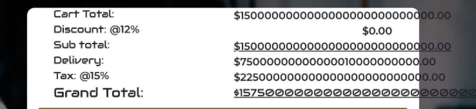

# Testing

1. [**Development Testing**](#development-testing)
2. [**Manual Testing**](#manual-testing)
   - [**Responsive**](#responsive)
   - [**Navbar and Footer**](#navbar-and-footer)
   - [**Home**](#home)
   - [**Shop, Shopping Cart and  Checkout**](#shop-shopping-cart-and-checkout)
   - [**Blogs**](#blogs)
   - [**Member selection, Programs list and Subscription payment**](#member-selection-orograms-list-subscription-payment)
   - [**Dashboard**](#dashboard)
   - [**Login**](#login)
   - [**The Admin**](#the-admin)
3. [**Automated Testing**](#automated-testing)
4. [**Bugs**](#bugs)
5. [**Validation**](#validation)

## Development Testing

Using Django Framework comes with a very useful Debug firsility. When Debug is on. If there is an error in the code the live server will stop and print out an error code. This is  printed out in the terminal and on the localhost.
Because of this feature a lot the bugs get fixed as they happen.

### Manual Testing

The manual testing is done for each user story and categorised into the different departments of the webpage.

#### Responsive

**User Storys**
*As a user, I want to access the website from any device.*

**Test**:

- Open each page of the website from multiple devices and multiple browsers
- Open with Chrome and Firefox Developer Tools. and click on "Responsive" to check all pages

**Results**: Fail
**Bug:**

- On the Home page in ‘Landscape orientation’, Section 2 was covering section 1’s navigation buttons. See Bugs Fix ‘Landscape orientation’.

**Verdict**: The issues were fixed, the test passed.
 <div align="right">

[Back to Top  ↑ ](#testing)
</div>

#### Navbar and Footer

**User Storys**
*As a user, I want to easily navigate between the pages
As a user, I want to link to the social pages of the company.*

**Test**:

- Click on all the links in the navbar, to check if they work properly pointing to the correct pages
- Make the navbar collapses on mobile and nav links are visible.
- Make sure the Navbar is Fixed at the top of the page
- Make sure the Login/Signup is visible if the user is not logged in.
- Make sure the Cart and username are always visible.
- Check when a product is added to the cart, ‘Empty’ is replaced with the Grand Total, and changes colour to green.

**Results**:

- Checked the link on all pages, they are working as expected
- Navbar collapses on screen size 994px burger bar appears and links visible when clicked
- Navbar is Fixed at the top of each page
- Login/Signup is visible if the user is not logged in
- Cart and username are always visible.
- Added a Products to cart and the 'Empty' was replaced with a correct grand total in green.
- All tests Passed

 **Verdict**: All the functionality works as expected.

 <div align="right">

[Back to Top  ↑ ](#testing)
</div>

#### Home

**User Storys**
*As a user, I want to be able to see there special offers
As a user, I would like to see featured blogs and other Programs that are on offer*

**Tests**:

- Check the home page has a list of all the special offers
- Check the home page to see if featured blogs are shone
- Check the home page for a list of Training Programs

**Results**:

- Checked that Special offers are wherein section 4 of the home page
- Checked that Featured blogs wherein section 5 of the home page
- Checked that Training Programs wherein section 2 of the home page.
- All tests Passed

**Verdict**: All the functionality works as expected.
 <div align="right">

[Back to Top  ↑ ](#testing)
</div>

#### Shop, Shopping Cart and  Checkout

**User Storys**
*As a user, I want to be able to read the details of a product and be able to review and rate them.
As a user, I would like to be able to search for a Product
As a user, I would like to be able to purchase an item from the shop without having to log in and expect to receive a confirmation email.*

**Test**:

- Check the shop has a list of all the products
- Check when a product is clicked, the user is redirected to - the product detail page with all the information. Star rating, Catogeys, Price, and image.
- Check users can not rate or review products if not logged in.
- Check the user is not logged in, add the product to cart and - checkout using Stripe.
- Check the adjust and remove button in the cart.
- Check validation on the checkout form.
- Check emails for an email confirmation.
- Check if the user is logged in and is able to rate and review products

**Results**:

- Clicked on the shop button and was redirected to the products as expected
- After clicking on a product was redirected to the product details page.  Star rating, Catogeys, Price, and image were in the right places as expected.
- User not logged in, Tried to add a review but the button said ‘login in to review’
- Use not logged in, selected a product, was redirected to product detail page, added product to cart, redirected to cart page with the success message.
- Order summary was correct with all the correct information.
- Changed the qty and removed a product form the adjust cart button, they work as expected.
- Clicked Checkout button and redirected to check out page with all the correct placeholders are in place
- Got validation error when didn’t fill out all the forms fields, as expected
Checkout order using Stripe test card number 4242 42424 24242
- Redirected to a checkout success page with a list of all the order details
- Clicked on the ‘View Receipts’ link in the checkout success page and redirected to a new page with the receipt being shown.
- Checked Stripe Dashboard for payment_intent.succeeded  webhook, success as expected
- Check email and have received the confirmation email.
- All Tests Passed.

**Verdict**: All the functionality works as expected.
 <div align="right">

[Back to Top  ↑ ](#testing)
</div>

#### Blogs

**User Storys**
*As a user, I would like to be able to search for a blog post I'm interested in
As a user, I would like only other logged-in users to see my members' blog posts and I would like to be able to comment on other members' blogs posts.*

**Tests**:

- Check to see if blog posts are being shown.
- Check when blog post is clicked it goes to the blog post detail page
- Check the search blog search bar is working.
- Check to see if the right page is shown when no search results are found.
- Check to see if the right blogs are shown when searched.
- Click on members category, Check the right response is shown.
- Check the user is logged in and click on the members category.
- Click the write a comment button and check the comment is posted in the comment section of the blog post.

**Results**:

- Clicked the Blogs button on the main page and redirected to the blogs list as expected.
- Clicking on blogs redirects to the blog's detailed page as expected.
- Searching a word that is not in any title or content redirects to the No search results found page.
- Searching a known search result redirects to the blog posts as expected.
- Checked user is logged out, Clicked  members in the categories block and the right response is shown as expected.
- Logged in and clicked the members category again and members blogs are shown.
- Clicked a comment button and a comment form pop up as expected and a comment was posted in the comment section as expected.
- All Tests Passed

**Verdict**: All the functionality works as expected.
 <div align="right">

[Back to Top  ↑ ](#testing)
</div>

#### Member selection, Programs list, Subscription payment

**User Storys**
*As a user, I would like to be able to become a member by subscribing.
As a user, I would like to see the Professional programs they have to offer*

**Tests**:

- Check home page flow to become a subscriber
- Check Programs list is displaying list.
- Check only logged in users may see programs details.
- Check email confirmation and invoice
- Check logged in user flow to get to the member select page.
- Check members can watch work out programs.

**Results**:

- Click Training Programs and redirect to Programs page, as expected, checked that there is a list of programs to choose from.
- When clicked on a Training programs redirected to the login page as expected.
- Logged in, and clicked on Training Programs, redirected to Programs list, as expected.
- Clicked on a program and redirected to the Upgrade membership page, as expected
- Clicked on the ‘Select Membership’ button and redirected to the membership select page as expected.
- Clicked ‘Select’ button in the Professional membership card redirected to Membership Payment page as expected.
- Fill out the Stripe Card field with 424242 424242 424242 and click submit
- Redirected to the programs page as expected. Clicked on a program redirected to the workout page as expected.
- Clicked on workout redirected to the workout page where the video is able to play.
- Check Stripe Dashboard for Webhook subscription_created received: customer.subscription.created. As expected.
- Check email for confirmation and have one as expected.
- All Tests Passed

**Verdict**: All the functionality works as expected.
 <div align="right">

[Back to Top  ↑ ](#testing)
</div>

#### Dashboard

**User Storys**
*As a user, I would like to have a place where I can see all my past orders
As a user, I would like to be able to change my password and shipping address
As a member, I would like to see when my next subscription payment is due and be able to cancel at any time.*

**Tests**:

- Login in user and click on Dashboard link in navbar.
- Check Dashboard is displayed correctly.
- Check ‘Order History’ column is populated with the order history of the user
- Check order history is ordered newest to oldest
- Click on Order and test response.
- Check ‘Profile Admin’ column has the user's email.
- Check ‘Update password’ redirects to Password Reset Page.
- Check ‘Shipping Details’ redirects to Shipping Details form with pre populated shipping address. 
- Check ‘Subscription’ has the current user membership level in and redirects to subscriptions details
- Check subscription information and Cancel subscription button
- Check ‘Cancel Subscription’ button works

**Results**:

- Logging in clicked to Dashboard and redirected to Dashboard page as expected.
- Dashboard has 3 column Profile Admin, My Blogs, Order History. As expected.
- Order History has a list of all previous orders ordered by date, Newest to oldest. As expected.
- Clicked on a prevoirs order redirected to Order History page will all the information and stripe Receipt link opening up on a new page.
- Profile Admin has users emails as expected.
- Clicking on Shipping Details redirect to the shipping details page with all information pre populated as expected.
- Clicking on Updated Password does redirect to password Reset Page as expected.
- The Profile admin column has the membership level shown and clicking redirects to the Subscriptions page with Current Membership  members since date and Next payment due and a date.
- Clicking Cancel Subscription redirects to cancel subscription confirmation page.
- Failed. Clicking ‘Yes, Cancel my Subscription’ shows a NoReverseMatch error.
- A success message was shown as expected.

**Bug**: ‘Cancel Subscription’ button error.

**Verdict**: The issues were fixed, the test passed.
 <div align="right">

[Back to Top  ↑ ](#testing)
</div>

#### Login

**User Story**
*As a user, I would like to be able to login with a social account.*
**Test**

- Check Social accounts Google
- Check Social accounts Facebook
- Check Logout
- Check Login with email and password
- Check Validation on email

**Results**:

- Click the ‘Sign In with Google’ button and a google pop asked me which Google account to use, and redirected me to the home page as expected.
- Clicked the ‘facebook’ button,redirected me to facebook password section, then redirected me back to the home page, as expected.
- Clicked the logout button and redirected to the logout confirmation page, clicked the confirmation button and redirected to the home page.
- Added wrong information into the email field and validation failed as expected.
- Correct the information and login in, redirected to the home page, as expected.

**Verdict**: All the functionality works as expected.
 <div align="right">

[Back to Top  ↑ ](#testing)
</div>

#### The Admin

**User Storys**
*As the admin, I expect to be able to log in from any page.
As admin, I expect to be able to add, edit, delete products, blogs, programs and  memberships as needed.
As admin, I expect to be able to put products out of stock and on special.
As admin, I would like that if a staff member did not put the right ‘was’ price of the product that only the ‘price’ would be shown.
As admin, I would like to be able to see what products have had the most views and heights
As admin, I would like to be able to see all the orders that have taken place.
As admin, I expect to see a ‘No Image’ image if there is no image for a product.*

**Tests**:

- Check the admin login icons are shown on all pages
- Check in the admin area, all the different department are visible
- Check the ability to add, edit, and delete products, blogs, programs
- Check the ability to change user memberships
- Check the product ‘In stock’ checkbox works and shows in the product list
- Check if not in stock items are displayed in the special offers section.
- Check the product special offers check box works and shows the special offers in the home page section.
- Check the ‘was’ price is smaller that the price and if not check to ‘was’ price is not shown
- Check the shop admin has the ability to filter by most views
- Check the Shop orders are able to be seen. And order from newest to oldest with the name and shipping details.
- Check the ‘No-image’ product image is shown if the product image is not there.

**Results**:

- Paged throughout all the pages of the website and the admin icon was always there. As expected.
- Login to the admin and all the different department are visible, as expected
- Clicked on the ‘Products’ button and clicked on the products name, redirected to products details, I was able to edit, add, and delete a product. As expected.
- Clicked on the ‘Blogs’ button and clicked on the blogs name, redirected to blogs details, I was able to edit, add, and delete the blog post. As expected.
- Clicked on the ‘Programs’ button and clicked on the Programs name, redirected to program details, I was able to edit, add, and delete  the programs. As expected.
- Clicked on the ‘Products’ button in the Shop section and was able to Uncheck the ‘in Stock’ check box.
- Checked the products list in the shop and the ‘Out of Stock’ image was being shown.
- Fail: Out of stock product was still being shown in special offers.
- Fail: ‘was’ price is being shown
- Checked the products page, could filter by rating and could filter. As expected
- Checked Order in the Shop Order section and Order number, Date ordered, arranged from newest to oldest by default, able to filter by Date, Name, Order Total, Grand total or tax.
- Clicked on an order number and all the orders details and address where as expected.
- Cleared the image in the edit product section of the shop and no image was shown on the product in the shop and home page.

**Bug**: Out of stock product was still being shown in special offers
‘was’ price is being shown
**Verdict**: The issues were fixed, the test passed.
 <div align="right">

[Back to Top  ↑ ](#testing)
</div>

---

### Automated Testing

Automated testing is run in conjunction with the manual testing to get the most coverage of the website. The aim was not to get 100% coverage but to get the inner working tested. If there are some changes made to either the Views, Forms or Models, running the test afterwards will show up any compatibility bugs.

I used Django testing module, The Tests were written for Views, Forms, and Modulus and can be found in each application specific tests folders

- tests_models.py
- tests_forms.py
- tests_views.py

[Coverage.py](https://coverage.readthedocs.io/en/coverage-5.3/) is used to run the test to get the overall coverage of testing.
The configurations are stored in the .coveragerc file.

<details>
<summary>Coverage Report(Click for image)</summary>
<p align="center">


</p>
</details>

##### Running coverage in the command terminal:

To run the tests
`$ coverage run manage.py test `
To generate a coverage report on the terminal window.
`$ coverage report `
To generate a coverage report in HTML
`$ coverage html`

----

## Bugs

#### Bootstrap 4 Carousel Bug

I had a bug trying to get Bootstrap 4 carousel to work in a for loop. Because of the way the carousel works one of the sides has to have the `.active` class set on it.
**Fix**

> After a bit of looking on the internet the best way I found was to use a template within the carousel itself and put the .active class in a for loop with a counter so then the counter = 1 the active is added.

```HTML

 <div class="carousel-item active" id=”slide{{ forloop.counter }} ></div>

 ```

#### Featured Blogs

Could not get the carousel to work for featured blogs.
I was using a for loop to get the blog post to iterate through the list of blogs.
Underneath this I was using a `{if statement}` to pick out the featured post from the others.

```Python


Bootstrap carousel

all other blogs

But it was not working.
 ```

**Fix**
> When I tested the carousel to see if that was the problem, it worked fine.
I tested the if statement by adding `{{ blogs.featured }}` straight into the html and a `True False True False` was returned so I know the if statement was working.
To make the carousel work with looped objects, you have to loop the counter with 1 being active. [Bootstrap 4 Carousel Bug](#bootstrap-4-carousel-bug) This was causing my if statement to not work.
I went back to the `BlogListView` views and added a quarry set
 `feature_blog = Blog.objects.filter(featured=True)` and added it to the context
This way I would be able to have the carousel separate to the all_blogs loop.
This way get all blogs except for featured blogs and the carousel worked with featured blogs.

```Python

Bootstrap carousel





 ```

#### Landscape Orientation

On the Home page in ‘Landscape orientation’, Section 2 was covering section 1’s navigation buttons. Because I have section 2 overlapping some of section 1 buttons where getting covered
**Fit**
> I fond an anwser in [CSS-TRICKS](https://css-tricks.com/snippets/css/media-queries-for-standard-devices/) media query to fix this issue, using This code I was able to control the height of section-1 as so it only did this on landscape orientated devices. 
This gives section1 enough room by giving it a height of 147vh.

```CSS
@media only screen and (min-device-width: 320px)
and (max-device-width: 568px)
and (-webkit-min-device-pixel-ratio: 2)
and (orientation: landscape) {
  #section1-pic {
    height: 147vh;
  }
}
 ```

> I realize this solutions is limited to certain screen sizes of
 (min-device-width: 375px) and (max-device-width: 667px)
(min-device-width: 320px) and (max-device-width: 568px)
(min-device-width: 375px) and (max-device-width: 812px)
Because of the design of the webpage I’m confident that 90% of users will use the app in portrait view.

---

#### Cancel Subscription

'Cancel my Subscription’ button error.
When Running the test: Check ‘Cancel Subscription’ button works’
I was getting a error saying `Not a valid namespace`
When refactoring my code and changing the memberships urls to have a namespace I  forgot to change the `href` in the anchor tag, this bug was picked up during my manual testing.
**Fix**
> Added the namespace into the href

```HTML

<a href=””
 ```

#### Stock Items Bug

When running the test: Check if not in stock items are displayed in the special offers section.
It came to my attention that out of stock products were still being displayed in the special offers page on the home page.
**Fix**
> I used an if statement in the template tags to check if the ‘in stock’ was true or false, if true it shows if false it does not.

```python

 
 ```
#### Was Price Bug

When running the test: Check the ‘was_price’ is smaller than the price and if not check to ‘was’ price is not shown.
I found a bug that the ‘was_price' was showing even if it was smaller than the ‘price’
**Fix**
> I used a if statement in the template tags too much the ‘was_price’ against the ‘price’ if the statement is true the ‘was_price’ is shown.

```python

 ```

#### Sales Items Bug

When testing the bug [Was Price Bug](#was-price-bug) I found another bug,
If the ‘Sales Items’ button is unchecked but the product still had a ‘was_price’ on it, the ‘was_price’ was still being displayed
**Fix**
> Because I had the logic inplace from the last bug all I had to do was add a ‘and’ connector in the template literal to filter any products where ‘sales_items’ is true.

```python

 ```

#### Shopping Cart Input Qty

I found a bug in the shopping cart. In the Qty form input, it was possible to type as many numbers as you liked and adjust your cart. This will cause a problem with all the styling and the layout.
I added `maxlength` to the input and that helped if the user pressed `Return` on the keyboard, it gives a validation error, but if the user types the number and presses the 'Update' button all the products can still be added.

As the buttons input attributes `min="1" max="99" maxlength="3"`was being overridden I made a change in the adjust_cart view,
The original code:

```python
if quantity > 0:
  ```
  
This was letting any number in above 0
**Fix**

```python
if quantity in range(0, 1000)
 ```

> This lets any number between 0 and 1000 anything over this the cart is emptied and returned to the cart view.

 <div align="right">

[Back to Top  ↑ ](#testing)
</div>

----
### Validation

- **Traivs**
[Travis](https://travis-ci.org/) was used in the unit testing of this product, It automatically tests code changes, providing immediate feedback on the success of the change. The configuration file is `.travis.yml`.
[](https://travis-ci.org/Clinton-Davis/focus_fitness) 
- **Codacy**
[Codacy](https://www.codacy.com/) is an automated Code Validator that checks the quality of your code after every push to GitHub.
[](https://www.codacy.com/manual/Clinton-Davis/focus_fitness/dashboard?utm_source=github.com&amp;utm_medium=referral&amp;utm_content=Clinton-Davis/focus_fitness&amp;utm_campaign=Badge_Grade)
- **HTML**
All HTML pages were tested with W3C Markup Validation Service. There are a good few errors because the W3C Markup does not recognize Jinja templating. No other errors.
- **CSS**
I ran my css file through the W3c CSS Validation Service.
I got a couple of errors all pointing to (min-device-width) which is in a media query for iPhone and iPads The CSS code for that is from CSS-TRICKS and it works perfectly.
- **Python**
I use a package called [autopep8](https://pypi.org/project/autopep8/) to guide me in my python Validatorn through development.

 <div align="right">

[Back to Top  ↑ ](#testing)

</div>
 <div align="left">

[:arrow_left: Back to README](#testing)

</div>
